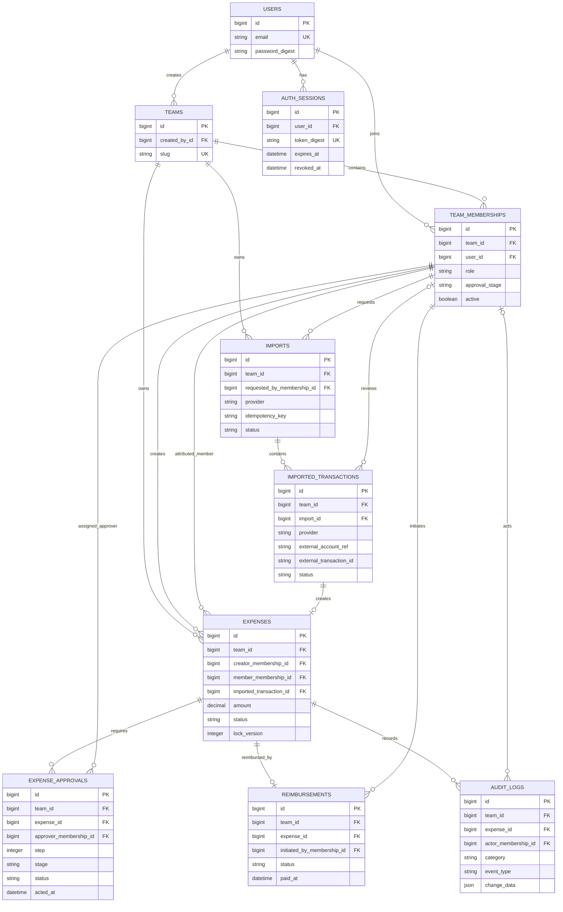

# Database Design

## Conventions

- PostgreSQL; Rails bigint primary keys; UTC timestamps.
- All tenant-owned records have `team_id`. Every foreign key is restrictive by default; deactivate users/memberships and logically delete expenses instead of cascading away financial history.
- `created_at` and `updated_at` are non-null Rails timestamps except append-only `audit_logs`, which has `created_at` only, and `auth_sessions`, which needs only `created_at`.
- `numeric(12,2)` stores monetary values without floating-point rounding. `currency` is a three-character uppercase code. Amounts are positive; currencies are not converted implicitly.
- Associations use ordinary scalar Rails IDs. Selected database composite foreign keys additionally ensure that a referenced membership or tenant-owned parent belongs to the same team.

## Tables

### `users`

| Column | Type | Null | Default |
| --- | --- | --- | --- |
| `id` | bigint PK | no | identity |
| `email` | varchar | no | none |
| `name` | varchar | no | none |
| `password_digest` | varchar | no | none |
| `disabled_at` | timestamptz | yes | none |
| `created_at`, `updated_at` | timestamptz | no | current time |

Foreign keys: none. Indexes: unique expression index on `lower(email)`. Checks: `email = lower(email)` and trimmed email/name are nonblank. Associations: has many team memberships and auth sessions. User records referenced by history are disabled, not deleted.

### `auth_sessions`

| Column | Type | Null | Default |
| --- | --- | --- | --- |
| `id` | bigint PK | no | identity |
| `user_id` | bigint FK | no | none |
| `token_digest` | varchar(64) | no | none |
| `expires_at` | timestamptz | no | none |
| `revoked_at`, `last_used_at` | timestamptz | yes | none |
| `created_at` | timestamptz | no | current time |

Foreign keys: `user_id -> users.id`, restrictive. Indexes/uniqueness: unique `token_digest`; `(user_id, expires_at)` supports session cleanup/management. Checks: digest is nonblank. Association: belongs to user.

### `teams`

| Column | Type | Null | Default |
| --- | --- | --- | --- |
| `id` | bigint PK | no | identity |
| `name` | varchar | no | none |
| `slug` | varchar | no | none |
| `created_by_id` | bigint FK | no | none |
| `created_at`, `updated_at` | timestamptz | no | current time |

Foreign keys: `created_by_id -> users.id`, restrictive. Indexes/uniqueness: unique `slug`. Checks: name and slug are nonblank. Associations: belongs to creator; has memberships, expenses, imports, and imported transactions. Team creation and its initial membership are one transaction.

### `team_memberships`

| Column | Type | Null | Default |
| --- | --- | --- | --- |
| `id` | bigint PK | no | identity |
| `team_id` | bigint FK | no | none |
| `user_id` | bigint FK | no | none |
| `role` | varchar | no | none |
| `approval_stage` | varchar | yes | none |
| `active` | boolean | no | `true` |
| `created_at`, `updated_at` | timestamptz | no | current time |

Foreign keys: `team_id -> teams.id`; `user_id -> users.id`, both restrictive. Indexes/uniqueness: unique `(team_id, user_id)` enforces exactly one active or inactive membership record per user/team pair; unique `(team_id, id)` to support tenant-matching composite references; `(user_id, team_id)` for a user's team list; partial unique `(team_id, approval_stage)` where `active`, `approval_stage IS NOT NULL`, and `role IN ('approver', 'admin')`. Checks: role in `creator`, `approver`, `viewer`, `admin`; creators and viewers require null `approval_stage`; approvers require `manager` or `finance`; admins may have null, `manager`, or `finance`. An admin with null stage is not eligible to approve. Associations: belongs to team/user; referenced by expense creator/member, approver, audit actor, reimbursement initiator, and import requester.

### `expenses`

| Column | Type | Null | Default |
| --- | --- | --- | --- |
| `id` | bigint PK | no | identity |
| `team_id` | bigint FK | no | none |
| `creator_membership_id` | bigint | no | none |
| `member_membership_id` | bigint | no | none |
| `imported_transaction_id` | bigint | yes | none |
| `amount` | numeric(12,2) | no | none |
| `currency` | varchar(3) | no | none |
| `merchant` | varchar | no | none |
| `description` | text | yes | none |
| `category` | varchar | yes | none |
| `incurred_on` | date | no | none |
| `status` | varchar | no | `draft` |
| `submitted_at`, `deleted_at` | timestamptz | yes | none |
| `lock_version` | integer | no | `0` |
| `created_at`, `updated_at` | timestamptz | no | current time |

Foreign keys: `team_id -> teams.id`; `(team_id, creator_membership_id) -> team_memberships(team_id, id)`; `(team_id, member_membership_id) -> team_memberships(team_id, id)`; optional `(team_id, imported_transaction_id) -> imported_transactions(team_id, id)`. Composite references are skipped for the nullable import ID under PostgreSQL's default `MATCH SIMPLE` behavior. All are restrictive.

Indexes/uniqueness: unique `(team_id, id)` for composite child references; `(team_id, status, created_at)` for team/status lists; `(team_id, member_membership_id, created_at)` for expenses attributed to a member; `(team_id, creator_membership_id, status, created_at)` for a creator's drafts; unique `imported_transaction_id` to prevent one imported transaction creating multiple expenses (PostgreSQL permits multiple nulls).

Checks: amount > 0; currency matches `^[A-Z]{3}$`; status in `draft`, `submitted`, `approved`, `rejected`, `reimbursed`; `lock_version >= 0`; merchant nonblank. Services enforce transitions and relationship between status and timestamps.

Associations: belongs to team; belongs to creator and attributed member through separate `TeamMembership` associations; optionally belongs to imported transaction; has many approvals and audit logs; has one reimbursement. Deletion is logical via `deleted_at`.

### `expense_approvals`

| Column | Type | Null | Default |
| --- | --- | --- | --- |
| `id` | bigint PK | no | identity |
| `team_id` | bigint FK | no | none |
| `expense_id` | bigint | no | none |
| `step` | smallint | no | none |
| `stage` | varchar | no | none |
| `approver_membership_id` | bigint | no | none |
| `status` | varchar | no | none |
| `acted_at` | timestamptz | yes | none |
| `rejection_reason` | text | yes | none |
| `created_at`, `updated_at` | timestamptz | no | current time |

Foreign keys: `team_id -> teams.id`; `(team_id, expense_id) -> expenses(team_id, id)`; `(team_id, approver_membership_id) -> team_memberships(team_id, id)`, restrictive. Indexes/uniqueness: unique `(team_id, expense_id, step, approver_membership_id)` prevents duplicate assignment while allowing multiple approver rows at a step in a future extension; `(team_id, approver_membership_id, status, created_at)` for approver queues.

Checks: step > 0; `(step, stage)` is `(1, manager)` or `(2, finance)`; status in `queued`, `pending`, `approved`, `rejected`, `skipped`; `queued`/`pending` require null `acted_at`; decided statuses require `acted_at`; rejected requires a nonblank reason. Associations: belongs to expense and assigned team membership.

### `reimbursements`

| Column | Type | Null | Default |
| --- | --- | --- | --- |
| `id` | bigint PK | no | identity |
| `team_id` | bigint FK | no | none |
| `expense_id` | bigint | no | none |
| `initiated_by_membership_id` | bigint | no | none |
| `amount` | numeric(12,2) | no | none |
| `currency` | varchar(3) | no | none |
| `status` | varchar | no | `pending` |
| `external_reference` | varchar | yes | none |
| `paid_at` | timestamptz | yes | none |
| `failure_reason` | text | yes | none |
| `created_at`, `updated_at` | timestamptz | no | current time |

Foreign keys: `team_id -> teams.id`; `(team_id, expense_id) -> expenses(team_id, id)`; `(team_id, initiated_by_membership_id) -> team_memberships(team_id, id)`, restrictive. Indexes/uniqueness: unique `(team_id, expense_id)` for one full reimbursement per expense; `(team_id, status, created_at)` for payout queues.

Checks: positive amount; uppercase three-character currency; status in `pending`, `processing`, `paid`, `failed`, `cancelled`; `paid_at IS NOT NULL` exactly when status is `paid`; failed status requires a failure reason. Full reimbursement amount/currency matching the expense is checked by the service because a SQL check cannot safely compare another row. Associations: belongs to expense and initiating membership.

### `audit_logs`

| Column | Type | Null | Default |
| --- | --- | --- | --- |
| `id` | bigint PK | no | identity |
| `team_id` | bigint FK | no | none |
| `expense_id` | bigint | no | none |
| `actor_membership_id` | bigint | yes | none for system events |
| `actor_type` | varchar | no | none |
| `category` | varchar | no | none |
| `event_type` | varchar | no | none |
| `change_data` | jsonb | no | `{}` |
| `request_id` | varchar | yes | none |
| `created_at` | timestamptz | no | current time |

Foreign keys: `team_id -> teams.id`; `(team_id, expense_id) -> expenses(team_id, id)`; optional `(team_id, actor_membership_id) -> team_memberships(team_id, id)`, restrictive. Indexes: `(team_id, expense_id, created_at, id)` for chronological history.

Checks: category is `crud` or `workflow`; CRUD event type is `create`, `update`, or `delete`; workflow event type is `submitted`, `approved`, `rejected`, `reimbursement_paid`, or `import_accepted`; actor type is `user` or `system`; user actor requires membership ID and system actor requires null. Association: belongs to expense and optionally actor membership. Audit rows are immutable.

### `imports`

| Column | Type | Null | Default |
| --- | --- | --- | --- |
| `id` | bigint PK | no | identity |
| `team_id` | bigint FK | no | none |
| `requested_by_membership_id` | bigint | no | none |
| `provider` | varchar | no | none |
| `idempotency_key` | varchar | no | none |
| `status` | varchar | no | `queued` |
| `started_at`, `finished_at` | timestamptz | yes | none |
| `error_summary` | text | yes | none |
| `created_at`, `updated_at` | timestamptz | no | current time |

Foreign keys: `team_id -> teams.id`; `(team_id, requested_by_membership_id) -> team_memberships(team_id, id)`, restrictive. Indexes/uniqueness: unique `(team_id, provider, idempotency_key)` deduplicates import requests; unique `(team_id, id)` supports imported transaction composite reference; `(team_id, status, created_at)` for operations monitoring.

Checks: status in `queued`, `running`, `completed`, `failed`; provider and idempotency key nonblank. Association: belongs to team/requester; has many imported transactions.

### `imported_transactions`

| Column | Type | Null | Default |
| --- | --- | --- | --- |
| `id` | bigint PK | no | identity |
| `team_id` | bigint FK | no | none |
| `import_id` | bigint | no | none |
| `provider` | varchar | no | none |
| `external_account_ref` | varchar | no | none |
| `external_transaction_id` | varchar | no | none |
| `amount` | numeric(12,2) | no | none |
| `currency` | varchar(3) | no | none |
| `merchant` | varchar | no | none |
| `description` | text | yes | none |
| `category` | varchar | yes | none |
| `transaction_date` | date | no | none |
| `raw_payload` | jsonb | yes | none |
| `status` | varchar | no | `pending` |
| `reviewed_by_membership_id` | bigint | yes | none |
| `reviewed_at` | timestamptz | yes | none |
| `rejection_reason` | text | yes | none |
| `created_at`, `updated_at` | timestamptz | no | current time |

Foreign keys: `team_id -> teams.id`; `(team_id, import_id) -> imports(team_id, id)`; optional `(team_id, reviewed_by_membership_id) -> team_memberships(team_id, id)`, restrictive. Indexes/uniqueness: unique `(team_id, provider, external_account_ref, external_transaction_id)` is the external transaction idempotency key; unique `(team_id, id)` supports expense composite reference; partial `(team_id, transaction_date)` where status is `pending` supports pending review.

Checks: amount > 0; currency matches `^[A-Z]{3}$`; status in `pending`, `accepted`, `rejected`; pending rows have no review timestamp/reviewer; accepted/rejected rows require reviewer and timestamp; rejected rows require nonblank reason; provider, account reference, external ID, and merchant are nonblank. Category is optional and limited to 100 characters at the model layer to match `expenses.category`. `raw_payload` must be sanitized and contain no secrets. Associations: belongs to import/team; optionally belongs to reviewing membership; has at most one resulting expense.

## Relationships and tenant foreign keys

Ordinary `belongs_to`/`has_many` associations use scalar bigint IDs, so normal Rails lookup and association behavior remains simple. Unique `(team_id, id)` indexes on membership/expense/import/imported-transaction tables supply referenced keys for composite constraints. The following composite constraints are the deliberate tenant-boundary checks; unrelated references (such as `teams.created_by_id -> users.id`) use ordinary foreign keys.

| Composite foreign key | Why it is needed |
| --- | --- |
| Expenses `(team_id, creator_membership_id)` and `(team_id, member_membership_id)` -> memberships `(team_id, id)` | Prevents an expense from being authored by or attributed to a membership in another team. |
| Expenses `(team_id, imported_transaction_id)` -> imported transactions `(team_id, id)` | Prevents linking an expense to another team's imported row. Nullable source is allowed. |
| Expense approvals `(team_id, expense_id)` -> expenses `(team_id, id)` | Ensures approval rows cannot be attached to an expense from another team. |
| Expense approvals `(team_id, approver_membership_id)` -> memberships `(team_id, id)` | Ensures the assigned approver belongs to the expense's team. |
| Reimbursements `(team_id, expense_id)` -> expenses `(team_id, id)` | Keeps reimbursement attached to an expense in the same team. |
| Reimbursements `(team_id, initiated_by_membership_id)` -> memberships `(team_id, id)` | Keeps the initiating actor in the same team. |
| Audit logs `(team_id, expense_id)` -> expenses `(team_id, id)` | Prevents audit history from being associated with the wrong tenant's expense. |
| Audit logs `(team_id, actor_membership_id)` -> memberships `(team_id, id)` | Prevents a user actor from being recorded through another team's membership. Null is allowed for system events. |
| Imports `(team_id, requested_by_membership_id)` -> memberships `(team_id, id)` | Keeps the import requester inside the owning team. |
| Imported transactions `(team_id, import_id)` -> imports `(team_id, id)` | Prevents a transaction row from being stored under another team's batch. |
| Imported transactions `(team_id, reviewed_by_membership_id)` -> memberships `(team_id, id)` | Keeps the reviewing actor inside the owning team. Null is allowed before review. |

Rails model associations continue to use their scalar foreign-key columns. In Rails 7.1 migrations, express composite constraints with the migration API if supported by the PostgreSQL adapter; otherwise add named reversible SQL via `execute`. This is database integrity, not a composite Rails primary key. Verify migration, schema dump, and fresh database load preserve every composite constraint. If `schema.rb` cannot represent them faithfully, use `structure.sql`; never silently omit the constraints. Pundit scopes remain necessary: database constraints do not replace request authorization.

## Important indexes and uniqueness

| Index | Purpose |
| --- | --- |
| Unique `lower(users.email)` | Case-insensitive account identity and login lookup. |
| Unique `auth_sessions.token_digest`; `(user_id, expires_at)` | O(1) bearer-session lookup and user session cleanup. |
| Unique `(team_id, user_id)` and `(user_id, team_id)` | One membership per team/user; efficiently enumerate a user's teams. |
| Partial unique `(team_id, approval_stage)` for active memberships with role `approver` or `admin` and a non-null stage | Implements one active Manager and one active Finance approver per team, while allowing a stage-assigned admin to approve. |
| `(team_id, status, created_at)` on expenses | Team expense queues filtered by status and ordered by recent creation. |
| `(team_id, member_membership_id, created_at)` on expenses | Expenses attributed to a team member. |
| `(team_id, creator_membership_id, status, created_at)` on expenses | Creator's own drafts and created-expense list. |
| Unique `expenses.imported_transaction_id` | Database-level one-expense-per-imported-transaction protection; multiple nulls remain allowed. |
| Unique `(team_id, expense_id, step, approver_membership_id)`; approval queue index | Prevent duplicate assignment and find pending work per approver. |
| Unique `(team_id, expense_id)` on reimbursements; `(team_id, status, created_at)` | One full reimbursement per expense and payout queues. |
| `(team_id, expense_id, created_at, id)` on audit logs | Fetch one expense's ordered audit history. |
| Unique `(team_id, provider, idempotency_key)` on imports | Deduplicate client import requests. |
| Unique `(team_id, provider, external_account_ref, external_transaction_id)` | Deduplicate a provider transaction across batches and competing workers. |
| Partial `(team_id, transaction_date)` on pending imported transactions | Pending review queue without indexing completed/rejected rows. |

Do not add separate indexes for every foreign key automatically. Add one only when it supports a measured query or a uniqueness/foreign-key requirement not already served by a composite index.

## Idempotency guarantees

The three unique constraints address separate duplication paths: the import request key deduplicates starting a batch; the external transaction key deduplicates provider data across batches/retries; unique `expenses.imported_transaction_id` prevents multiple expenses from one imported transaction. Workers may use `INSERT ... ON CONFLICT DO NOTHING`, then load the row selected by the unique key. A prior `find_by` is not sufficient for concurrency correctness.

## ER diagram

## Assumptions and trade-offs

- One active approver per team per stage for this take-home. An `admin` membership may optionally have one approval stage and can approve only when assigned to that stage; a null-stage admin cannot approve. Creator/viewer stages must be null. Approval rows already identify an approver per step, allowing a future group approval rule.
- An expense has one attributed team member and one creator; admins alone may attribute new expenses to another member.
- Reimbursement is full and one-per-expense. Partial/multiple reimbursements would need an allocation model and are out of scope.
- Rejected expenses are terminal because no resubmission transition was specified.
- `bcrypt` must be added explicitly for `has_secure_password`.
- Composite foreign keys add migration/schema-dump complexity in exchange for database-enforced tenant consistency. Keep Rails associations scalar and test a fresh schema load before adding application code.